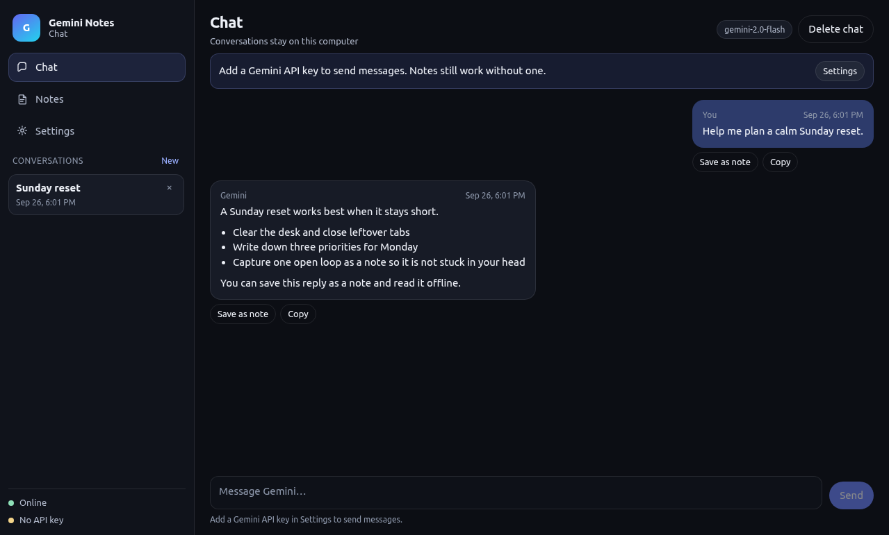
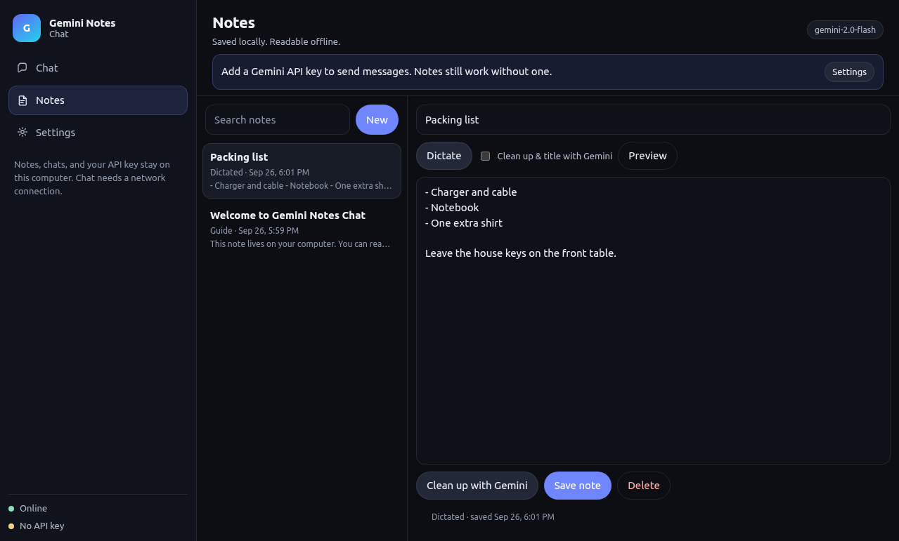
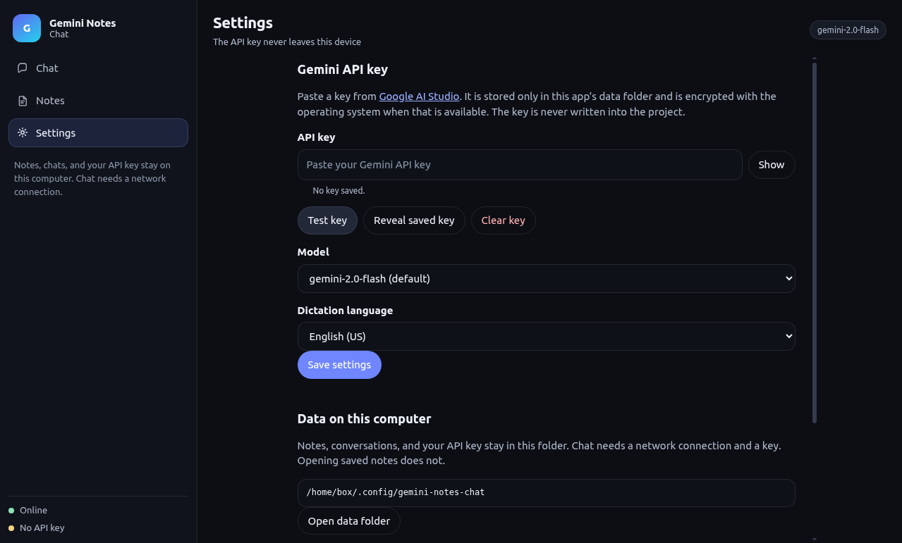

# Gemini Notes Chat

Desktop app for chatting with Google Gemini and keeping notes on your computer. Notes and past conversations open offline. Sending a chat, cleaning up a note, or transcribing recorded audio needs a network connection and your own Gemini API key.

The key is entered in **Settings**. It is stored in the app’s data folder (encrypted with the operating system safe storage when that is available). It is not hardcoded and it is not written into this repository.

## Screenshots

Captured from the running app. Regenerate them with the command in [Capture screenshots](#capture-screenshots). Replace the files if you want updated placeholders in the docs.







## Mobile version (Android app + web app)

There is a phone version in [`mobile/`](mobile/) with the same three screens (**Chat**, **Notes**, **Settings**) in a touch-friendly dark layout. It is free to use: you only need your own free Gemini API key from [Google AI Studio](https://aistudio.google.com/apikey).

### Android app (APK)

1. On your Android phone, open the [latest release](https://github.com/lhymite36-bot/gemini-notes-chat/releases/latest) and download **GeminiNotesChat-1.1.1.apk**.
2. Open the downloaded file. If Android says the install is blocked, tap **Settings** and turn on **Allow from this source** (the “Install unknown apps” permission for Chrome or your Files app), then go back and tap **Install**.
3. If Play Protect warns about an unknown app, tap **More details › Install anyway**. The app is not on the Play Store, so Google does not recognize it; the source code is all in this repository.
4. Open **Gemini Notes Chat**, go to **Settings**, paste your Gemini API key, and tap **Save key**.
5. The first time you tap the mic, allow the **Microphone** permission.

Voice dictation in the app uses Android’s built-in speech recognition (the Google app / “Speech Recognition & Synthesis”). It usually needs an internet connection. Android pauses listening when you stop talking; the app restarts it automatically until you tap the mic again, so you may hear a short beep between phrases.

### Web app (iPhone, or Android without installing an APK)

Open **https://lhymite36-bot.github.io/gemini-notes-chat/** on your phone.

- **Android (Chrome):** menu **⋮ › Add to Home screen** (or **Install app**).
- **iPhone (Safari):** **Share** button **› Add to Home Screen**.

It opens full-screen like an app and notes can be read offline. Voice dictation in the web version works best in **Chrome on Android**. On iPhone, Safari’s speech recognition is limited or missing; use the mic key on the iPhone keyboard to dictate into a note instead.

### Privacy

The API key, chats, and notes are stored only on the phone (app storage / `localStorage`). The key is sent only to Google’s Gemini API (`generativelanguage.googleapis.com`). Uninstalling the app or clearing site data deletes them; use **Settings › Export backup** first if you want a copy.

### Build the APK yourself

GitHub Actions builds it on every push to `mobile/` (workflow **Android APK**, artifact `GeminiNotesChat-apk`). Locally you need Node 20+, JDK 21, and the Android SDK:

```bash
cd mobile
npm install
npx cap sync android
cd android && ./gradlew assembleRelease   # signed with the debug key unless ANDROID_KEYSTORE_PATH etc. are set
```

The web files live in `mobile/www/` (plain HTML/CSS/JS, no build step) and are deployed to GitHub Pages by the **Deploy mobile web app** workflow.

## Requirements

- Node.js 20 or newer. This project uses Electron 44, whose package metadata asks for Node 22. On Node 20, `npm install` may print an `EBADENGINE` warning; the app still installs and runs.
- npm
- A Gemini API key from [Google AI Studio](https://aistudio.google.com/apikey) for chat and note cleanup

## Install

```bash
npm install
```

## Run in development

```bash
npm start
```

The window opens on the Chat screen. Use **Settings** (or `Ctrl+,`) to paste and save the API key, then send a message. Use **Notes** to write or dictate a note.

On Linux, if Electron exits with a sandbox or SUID error, start it with Chromium’s sandbox disabled:

```bash
npx electron --no-sandbox --disable-gpu .
```

## Where the API key goes

1. Open **Settings**.
2. Paste the key from Google AI Studio.
3. Choose a model. The default is `gemini-3.8-flash`. `gemini-flash-latest`, `gemini-3.5-flash`, and `gemini-3.5-flash-lite` are also listed, and you can enter another model id.
4. Click **Save settings**. **Test key** checks the key against the selected model.

The key is kept in `settings.json` inside the app data folder. **Settings** shows the exact path and can open that folder.

Typical locations:

| System | Folder |
| --- | --- |
| Linux | `~/.config/gemini-notes-chat/` |
| Windows | `%APPDATA%\gemini-notes-chat\` |
| macOS | `~/Library/Application Support/gemini-notes-chat/` |

Do not commit a key. `.env`, `api-key` files, `node_modules`, and build output are listed in `.gitignore`. The app does not read a key from `.env`.

## Notes and dictation

- **New** creates a note. **Save note** writes it to `notes.json`. **Delete** removes it.
- **Dictate** uses the Web Speech API (`SpeechRecognition` in Chromium) and saves the transcript when you press **Stop**.
- Live transcription usually needs a microphone and a network connection. It does not need an API key.
- If live transcription is unavailable, the app records audio with `MediaRecorder` and asks Gemini to transcribe it. That path needs an API key and a network connection.
- **Clean up & title with Gemini** (during dictation) or **Clean up with Gemini** (while editing) asks the model for a title and a cleaned-up body. Dictation still saves the raw transcript if cleanup fails.
- In chat, **Save as note** stores that message locally.

Dictation language is chosen in Settings. A take stops automatically after two minutes.

## Offline behavior

Saved notes and previous chats load from disk with no network. You can read, edit, create, and delete notes offline. Chat send, key test, cleanup, and audio transcription show a clear error until you are back online with a valid key.

## Scripts

| Script | What it does |
| --- | --- |
| `npm start` | Run the app in development with Electron |
| `npm run build` | Package an unpacked app for the current OS into `dist/` (`electron-builder --dir`) |
| `npm run dist` | Build installers for the current OS |
| `npm run dist:linux` | Linux AppImage and `.deb` |
| `npm run dist:win` | Windows NSIS installer and portable `.exe` |
| `npm run check` | Local checks for note formatting and Gemini request shaping (no network) |

## Build a Linux app

```bash
npm install
npm run build
```

The unpacked app is `dist/linux-unpacked/gemini-notes-chat`. You can run that binary directly.

An AppImage is written to `dist/GeminiNotesChat-1.0.0-x86_64.AppImage`:

```bash
npx electron-builder --linux AppImage --publish never
chmod +x dist/GeminiNotesChat-1.0.0-x86_64.AppImage
./dist/GeminiNotesChat-1.0.0-x86_64.AppImage
```

`npm run dist:linux` also builds a `.deb`. That step needs `fakeroot` (and usually `dpkg`). If it fails, use the unpacked directory or the AppImage.

## Build a Windows installer

Windows targets are already configured in `package.json`:

- NSIS installer: `GeminiNotesChat-Setup-<version>.exe` (per-user, you can choose the folder)
- Portable build: `GeminiNotesChat-Portable-<version>.exe`

On a Windows machine:

```bash
npm install
npm run dist:win
```

Building the Windows installer on Linux needs [Wine](https://www.winehq.org/), because NSIS runs under Wine there. electron-builder does not produce a native Windows `.exe` from Linux without it.

```bash
sudo apt install wine
npm run dist:win
```

Wine was not required to produce the Linux build from this project.

## Build on macOS

```bash
npm install
npx electron-builder --mac dmg
```

Package the Mac app on macOS. A 512×512 PNG is at `assets/icon.png`. electron-builder on macOS can turn that into an `.icns` icon.

## Project structure

```
electron/main.js       Window, menu, IPC, app:// pages
electron/preload.js    The only bridge the page can call
electron/store.js      Notes, chats, and the API key on disk
electron/gemini.js     @google/generative-ai calls
electron/logic.js      Validation and request shaping
renderer/              HTML, CSS, and the UI
assets/icon.png        App icon
assets/icon.ico        Windows icon
docs/screenshots/      Screenshot placeholders
```

## Capture screenshots

With a display available:

```bash
GEMINI_NOTES_SCREENSHOTS=1 npx electron --no-sandbox .
```

That writes `docs/screenshots/chat.png`, `notes.png`, and `settings.png`, then quits. It also stores a sample conversation and a sample note in the app data folder.

## Troubleshooting

- **The key test fails.** Confirm the key in Google AI Studio and try `gemini-flash-latest` or another model id. New AI Studio keys (starting with `AQ.`) cannot use the 2.x models (Google returns 404 or `401 ACCESS_TOKEN_TYPE_UNSUPPORTED`); the mobile app switches to a working model automatically and shows the raw API error under **Details**.
- **“Could not reach Gemini.”** Chat needs the public Gemini API (`generativelanguage.googleapis.com`). A VPN, firewall, or offline network will block it. Notes still open.
- **Dictation does nothing.** Allow the microphone. If Chromium’s speech service is blocked, the app switches to recording plus Gemini transcription when a key is saved.
- **OS encryption unavailable.** On Linux this uses the desktop secret service. Without one, the key is stored in `settings.json` with user-only file permissions. The Settings screen says which mode is in use.
- **Sandbox error on Linux.** Launch with `--no-sandbox`.

## License

MIT. See [LICENSE](LICENSE).
